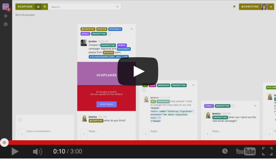

Braid started out as a quick experiment to see if a new kind of team-chat interface could better handle multiple async conversations (early video here) , and in turn, alleviate the culture of interruption and FOMO that Slack and other chatroom-based clients tend to create. (see [Motivation]()).

teams that believe focus and flow are more productive than constant interruptions and FOMO

Braid's design fosters productive conversations and allows for deep integrations with other services (think "1:1 sync", not just "chat bots").

Our goal is to develop Braid into an *open* platform that unites all of a group's communication streams.

### Beyond Chatrooms & Towards Productive Group Communication

Several factors converge to make chat-rooms bad at fostering productive group communication (you can read [our thoughts on the matter](./docs/background/chat-rooms-considered-harmful.md)), but, at its core, it comes down to chat-rooms being single-threaded: each room is a linear stream of messages. The "flat vs threaded" debate is an old one, and, unfortunately, the other end of the spectrum – full threading – [has it's own set of problems](https://blog.codinghorror.com/web-discussions-flat-by-design/). But perhaps we can find a happy middle...

Braid started out as a weekend experiment: what if, instead of multiple rooms, you had *one* place where you can have *many* *short* conversations?

...each conversation would stick around only for as long as it was relevant, and could be tagged to direct it to the appropriate recipients (and to help with future retrieval). We made [a quick proof-of-concept](https://www.youtube.com/watch?v=pa2bUsChFqM), and quickly realized that we were on to something.

Braid has evolved quite a bit since then, so here's how it looks now:

You may be thinking: "Isn't this pretty much like email ...except optionally real-time ...and with integrations ...and with shared tags?"

Well... Yes. Yes it is.

And it's *awesome*.

why:
address the interruption-culture
get your focus
that promotes *productive* team communication, while still respecting each individual's need for focus.

for who:
teams that care about productivity and focus
remote teams that need to support an async workflow
online communities who want to have productive real-time conversations

how:
 - Instead of Slack-like chatrooms, Braid takes a new approach: discrete conversations and tags.
   without chatrooms
   different approach to chat interface
   email/forum/chat hybrid

what:

  threaded chat
  #tags
  @groups
  1:1 integrations

## History

## Catalysis (January 2016 -)

In early 2016, discussions started on the #clojurians Slack community regarding migrating away from Slack due to concerns about Slack not wanting to support large free communities (a few months earlier, the Reactiflux community had to abandon Slack because they hit Slack's user limits). A recurring suggestion was for the community to develop their own clojure(script)-based alternative.

@jamesnvc and @rafd offered to open-source their client and to lead a community effort around developing it. Thus the code was open-sourced and Braid was officially born.

However, things were a bit rough: No docs. The UX needed a lot of polish. The 'get-it-working-locally' experience was horrible. Code needed cleaning. Basic features were missing. And so on...

## Present Day (Sep 2016)

Since then, with rekindled interest and the help of new contributors, much progress has been made.

Braid has many teams using it and new ones joining frequently.

